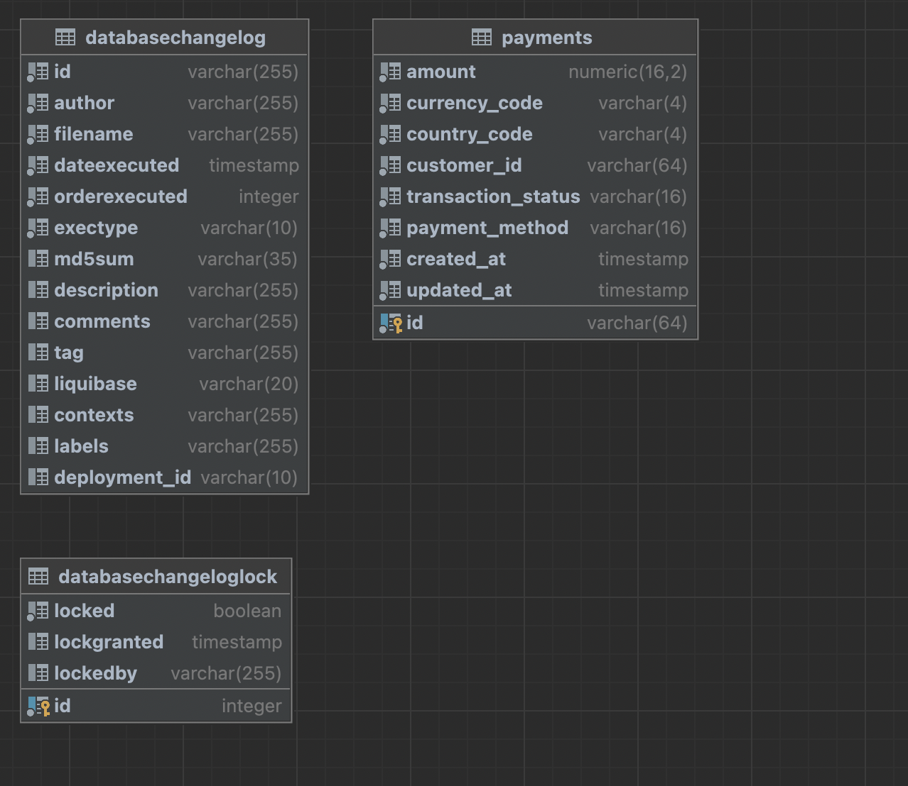

<h1 align="center"> ms.upgate.integration </h1> <br>

## Table of Contents

- [Introduction](#Introduction)
- [How to run locally](#How-to-run-locally)
- [Dependencies](#Dependencies from 3rd party)
- [Tech stack](#Tech-stack)
- [Swagger](#Swagger-link)
- [DB ERD](#Microservice-database-ERD)

## Introduction

This microservice responsible for integration with UpGate. In microservice exist 2 API's.
1. For initialize payment in UpGate,
    after successful response from this api we have redirection url from UpGate and in FE we can navigate to ecomm page
2. For callback (payment status update) when we initialize payment we send to UpGate our callback url 
   and after transaction finishing they call us and send status (SUCCESS,DECLINE,ERROR) 
   and we find from DB by paymentId data then update status

Also i added simple html page for understanding flow and demonstrating my basic html skills (pay.html)

## How to run locally
1. If you use idea you need to create postgresql DB with name ms_upgate_integration
   change username and password in application.yml and then run application from Application.kt class
2. If you want to use docker, you can run docker-compose up command, and your application started at 8080 port with default postgres database

```shell script
$ java -jar ms.upgate.integration.jar 
```

## Dependencies from 3rd party

1. [UpGate Payment orchestration platform](https://upgate.redoc.ly/)

## Tech stack
1. PostgreSQL
2. Spring Boot
3. Java 17
4. Kotlin 1.8.22
5. Liquibase
6. Spock Framework (Unit Testing groovy)
7. Feign
8. Docker

## Swagger link
[Link](http://localhost:8080/swagger-ui.html#/)

## Microservice database ERD



